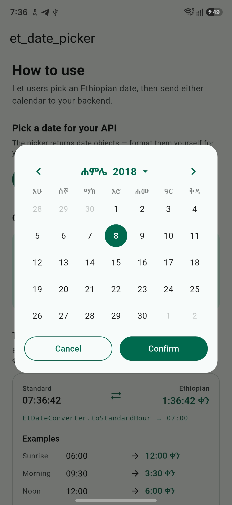
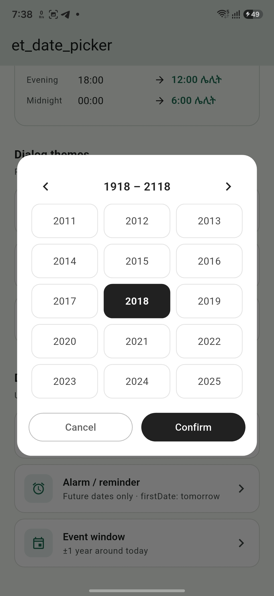

# et_date_picker

A Flutter package that lets users pick dates on the Ethiopian (Ge'ez) calendar. Developers can use either the Ethiopian date or the auto-converted Gregorian date, whichever fits their app.

## Screenshots

<table>
  <tr>
    <td align="center"><b>Day picker</b></td>
    <td align="center"><b>Dark theme</b></td>
    <td align="center"><b>Year picker</b></td>
  </tr>
  <tr>
    <td align="center"></td>
    <td align="center"></td>
    <td align="center"></td>
  </tr>
</table>

---

## Features

- Full Ethiopian calendar UI with Amharic month names and day-of-week labels
- Bidirectional date conversion — Ethiopian ↔ Gregorian
- Ethiopian time conversion (የኢትዮጵያ ሰዓት) — sunrise-based clock with ቀን / ሌሊት periods
- Correct 13-month calendar including Pagume (5 or 6 days)
- Optional Ethiopic numeral rendering (፩ ፪ ፫ …) with bundled Noto Sans Ethiopic font
- Swipeable month navigation with smooth page transitions
- Year and month grid picker — tap the header to jump to any year or month
- Dialog presentation via `showEthiopianDatePickerDialog`
- Fully themeable — respects your app's `ColorScheme`
- Unit tests covering date conversion edge cases including leap years

---

## Getting started

Add the package to your `pubspec.yaml`:

```yaml
dependencies:
  et_date_picker: ^0.0.1
```

Then run:

```bash
flutter pub get
```

Import in your Dart file:

```dart
import 'package:et_date_picker/et_date_picker.dart';
```

---

## Usage

### Dialog

```dart
final result = await showEthiopianDatePickerDialog(
  context: context,
  initialDate: EtDateConverter.today(),
);

if (result != null) {
  print(result.ethiopianDate.toAmharicString());
  print(result.gregorianDate);
}
```

The dialog shows a live preview of both the Ethiopian and Gregorian dates as the user selects a day, with Confirm and Cancel actions. Tap the header to open the year grid, pick a year, then pick a month — or swipe left/right to move one month at a time.

### Ethiopic numerals

```dart
final result = await showEthiopianDatePickerDialog(
  context: context,
  useEthiopicNumerals: true, // renders ፩ ፪ ፫ instead of 1 2 3
);
```

When `useEthiopicNumerals` is true, day numbers use the bundled Noto Sans Ethiopic font.

### Setting a date range

```dart
final result = await showEthiopianDatePickerDialog(
  context: context,
  firstDate: EthiopianDate(year: 2015, month: 1, day: 1),
  lastDate: EthiopianDate(year: 2020, month: 13, day: 5),
);
```

### Custom theme

```dart
final result = await showEthiopianDatePickerDialog(
  context: context,
  theme: EthiopianDatePickerTheme(
    dayTextStyle: TextStyle(color: Colors.black87),
    todayTextStyle: TextStyle(color: Colors.green.shade400),
    selectedDayTextStyle: TextStyle(
      color: Colors.white,
      backgroundColor: Colors.green.shade800,
      fontWeight: FontWeight.bold,
    ),
    confirmButtonStyle: ButtonStyle(
      backgroundColor: WidgetStatePropertyAll(Colors.green.shade800),
      foregroundColor: WidgetStatePropertyAll(Colors.white),
    ),
  ),
);
```

Unset theme properties fall back to the ambient `ThemeData` / `ColorScheme`.

### Date conversion only (no UI)

```dart
// Gregorian → Ethiopian
final etDate = EtDateConverter.toEthiopian(DateTime(2024, 10, 19));
print(etDate.toAmharicString()); // 9 ጥቅምት 2017
print(etDate.monthName);         // ጥቅምት
print(etDate.year);              // 2017
print(etDate.month);             // 2
print(etDate.day);               // 9

// Ethiopian → Gregorian
final gcDate = EtDateConverter.toGregorian(
  EthiopianDate(year: 2017, month: 2, day: 9),
);
print(gcDate); // 2024-10-19

// Today in Ethiopian calendar
final today = EtDateConverter.today();
```

### Time conversion

Ethiopian time counts from sunrise — standard 6:00 AM equals ET 12:00 ቀን.

```dart
// Standard DateTime → Ethiopian time
final etTime = EtDateConverter.toEthiopianTime(DateTime.now());
print(etTime.format()); // e.g. "3:30 ቀን"

// From explicit hour/minute/second (24-hour standard clock)
final etTime2 = EtDateConverter.toEthiopianTimeFromParts(
  hour: 15,
  minute: 30,
);

// Combined date + time
final etDateTime = EtDateConverter.toEthiopianDateTime(DateTime.now());
print(etDateTime.format()); // e.g. "9 ጥቅምት 2017 3:30 ቀን"

// Back to standard 24-hour clock
final standardHour = EtDateConverter.toStandardHour(etTime);
```

---

## Ethiopian calendar basics

The Ethiopian calendar (Ge'ez calendar) differs from the Gregorian calendar in a few key ways:

| | Ethiopian | Gregorian |
|---|---|---|
| Months | 13 | 12 |
| Days per month | 30 (fixed) | 28–31 |
| 13th month (Pagume) | 5 days (6 in leap year) | — |
| New Year | ~11 Sep (12 Sep after leap year) | 1 Jan |
| Year difference | ~7–8 years behind | — |

### Month names

| # | Amharic | Gregorian equivalent |
|---|---|---|
| 1 | መስከረም (Meskerem) | Sep – Oct |
| 2 | ጥቅምት (Tikimt) | Oct – Nov |
| 3 | ኅዳር (Hidar) | Nov – Dec |
| 4 | ታኅሣሥ (Tahsas) | Dec – Jan |
| 5 | ጥር (Tir) | Jan – Feb |
| 6 | የካቲት (Yekatit) | Feb – Mar |
| 7 | መጋቢት (Megabit) | Mar – Apr |
| 8 | ሚያዝያ (Miazia) | Apr – May |
| 9 | ግንቦት (Ginbot) | May – Jun |
| 10 | ሰኔ (Sene) | Jun – Jul |
| 11 | ሐምሌ (Hamle) | Jul – Aug |
| 12 | ነሐሴ (Nehase) | Aug – Sep |
| 13 | ጳጉሜ (Pagume) | Sep (5–6 days) |

---

## API reference

### `EthiopianDate`

```dart
EthiopianDate({
  required int year,
  required int month,  // 1–13
  required int day,    // 1–30 (1–6 for Pagume)
})
```

| Property / Method | Description |
|---|---|
| `monthName` | Amharic name of the month |
| `daysInMonth` | 30, or 5/6 for Pagume |
| `isPagume` | Whether this is the 13th month |
| `firstDayOfMonth` | Same year/month, day 1 |
| `lastDayOfMonth` | Same year/month, last valid day |
| `copyWith(...)` | Returns a copy with updated fields |
| `addMonths(int n)` | Navigate forward/backward by months |
| `toAmharicString()` | e.g. `"9 ጥቅምት 2017"` |
| `isEthiopianLeapYear(int year)` | Static — true when `year % 4 == 3` |

### `EtDateConverter`

| Method | Description |
|---|---|
| `toEthiopian(DateTime)` | Gregorian → Ethiopian date |
| `toGregorian(EthiopianDate)` | Ethiopian → Gregorian date |
| `today()` | Current date as `EthiopianDate` |
| `isSameDay(DateTime, DateTime)` | Day equality check |
| `isLeapYear(int year)` | Whether an Ethiopian year is a leap year |
| `toEthiopianTime(DateTime)` | Standard time → `EthiopianTime` |
| `toEthiopianTimeFromParts({hour, minute, second})` | Build `EthiopianTime` from clock parts |
| `toStandardHour(EthiopianTime)` | Ethiopian time → standard 24-hour hour |
| `toEthiopianDateTime(DateTime)` | Combined `EthiopianDateTime` |

### `EthiopianTime`

| Property / Method | Description |
|---|---|
| `hour` | 12-hour dial value (1–12) |
| `minute`, `second` | Same as standard clock |
| `isDay`, `isNight` | Whether the period is ቀን or ሌሊት |
| `periodLabel` | `"ቀን"` or `"ሌሊት"` |
| `format()` | e.g. `"3:30 ቀን"` |
| `formatWithSeconds()` | e.g. `"3:30:45 ቀን"` |

### `showEthiopianDatePickerDialog`

```dart
Future<EthiopianPickerResult?> showEthiopianDatePickerDialog({
  required BuildContext context,
  EthiopianDate? initialDate,
  EthiopianDate? firstDate,
  EthiopianDate? lastDate,
  bool useEthiopicNumerals = false,
  EthiopianDatePickerTheme? theme,
  String confirmLabel = 'Confirm',
  String cancelLabel = 'Cancel',
  double width = 360,
  ShapeBorder? shape,
})
```

Returns `null` if the user cancels. On confirm, returns both calendar representations:

```dart
result.ethiopianDate  // EthiopianDate
result.gregorianDate  // DateTime
```

### `EthiopianDatePickerTheme`

Key styling hooks: `backgroundColor`, `headerTextStyle`, `dowTextStyle`, `dayTextStyle`, `todayTextStyle`, `selectedDayTextStyle`, `disabledDayTextStyle`, `outsideDayTextStyle`, `selectedPreviewLabelStyle`, `selectedPreviewValueStyle`, `confirmButtonStyle`, `cancelButtonStyle`, `dayCellHeight`, `dayCellMargin`.

Use `selectedDayTextStyle.backgroundColor` for the selected-day circle fill and `todayTextStyle.color` for today's border ring.

---

## Contributing

Contributions are welcome. Please open an issue before submitting a pull request for significant changes.

When adding features, ensure:

- Conversion logic is covered by unit tests in `test/et_date_picker_test.dart`
- The example app demonstrates the new feature

---

## License

MIT License — see [LICENSE](LICENSE) for details.
